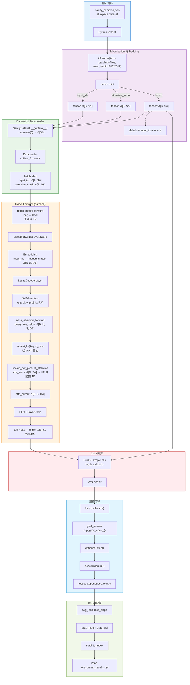
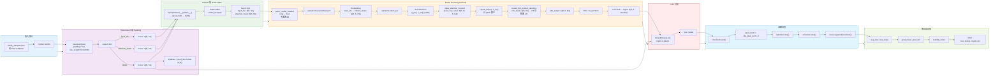

```mermaid
graph TD
    subgraph Input["輸入資料"]
        A1["sanity_samples.json<br>或 alpaca dataset"] --> A2["Python list/dict"]
    end

    subgraph Tokenization["Tokenization 與 Padding"]
        A2 --> B1["tokenizer(texts,<br>padding=True,<br>max_length=512/2048)"]
        B1 --> B2["output: dict"]
        B2 -->|"input_ids"| B3["tensor: &#91;B, S&#93;"]
        B2 -->|"attention_mask"| B4["tensor: &#91;B, S&#93;"]
        B2 -->|"labels"| B5["tensor: &#91;B, S&#93;"]
        B5 -.-> B5_note["(labels = input_ids.clone())"]
    end

    subgraph Dataset["Dataset 與 DataLoader"]
        B3 & B4 & B5 --> C1["SanityDataset.__getitem__()<br>→ squeeze(0) → &#91;S&#93;"]
        C1 --> C2["DataLoader<br>collate_fn=stack"]
        C2 --> C3["batch: dict<br>input_ids: &#91;B, S&#93;<br>attention_mask: &#91;B, S&#93;"]
    end

    subgraph Model["Model Forward (patched)"]
        C3 --> D1["patch_model_forward<br>long → bool<br>不要擴 4D"]
        D1 --> D2["LlamaForCausalLM.forward"]
        D2 --> D3["Embedding<br>input_ids → hidden_states: &#91;B, S, D&#93;"]
        D3 --> D4["LlamaDecoderLayer"]
        D4 --> D5["Self-Attention<br>q_proj, v_proj (LoRA)"]
        D5 --> D6["sdpa_attention_forward<br>query, key, value: &#91;B, H, S, D&#93;"]
        D6 --> D7["repeat_kv(key, n_rep)<br>已 patch 修正"]
        D7 --> D8["scaled_dot_product_attention<br>attn_mask: &#91;B, S&#93; → HF 自動擴 4D"]
        D8 --> D9["attn_output: &#91;B, S, D&#93;"]
        D9 --> D10["FFN + LayerNorm"]
        D10 --> D11["LM Head → logits: &#91;B, S, Vocab&#93;"]
    end

    subgraph Loss["Loss 計算"]
        D11 & B5 --> E1["CrossEntropyLoss<br>logits vs labels"]
        E1 --> E2["loss: scalar"]
    end

    subgraph Training["訓練流程"]
        E2 --> F1["loss.backward()"]
        F1 --> F2["grad_norm = clip_grad_norm_()"]
        F2 --> F3["optimizer.step()"]
        F3 --> F4["scheduler.step()"]
        F4 --> F5["losses.append(loss.item())"]
    end

    subgraph Output["輸出與記錄"]
        F5 --> G1["avg_loss, loss_slope"]
        G1 --> G2["grad_mean, grad_std"]
        G2 --> G3["stability_index"]
        G3 --> G4["CSV: lora_tuning_results.csv"]
    end

    %% === Styles ===
    style Input fill:#e3f2fd,stroke:#1976d2
    style Tokenization fill:#f3e5f5,stroke:#7b1fa2
    style Dataset fill:#e8f5e8,stroke:#388e3c
    style Model fill:#fff3e0,stroke:#f57c00
    style Loss fill:#ffebee,stroke:#c62828
    style Training fill:#e1f5fe,stroke:#0288d1
    style Output fill:#f1f8e9,stroke:#689f38

```
## landscape direction

```mermaid
graph LR
    subgraph Input["輸入資料"]
        A1["sanity_samples.json<br>或 alpaca dataset"] --> A2["Python list/dict"]
    end

    subgraph Tokenization["Tokenization 與 Padding"]
        A2 --> B1["tokenizer(texts,<br>padding=True,<br>max_length=512/2048)"]
        B1 --> B2["output: dict"]
        B2 -->|"input_ids"| B3["tensor: &#91;B, S&#93;"]
        B2 -->|"attention_mask"| B4["tensor: &#91;B, S&#93;"]
        B2 -->|"labels"| B5["tensor: &#91;B, S&#93;"]
        B5 -.-> B5_note["&#40;labels = input_ids.clone&#40;&#41;&#41;"]
    end

    subgraph Dataset["Dataset 與 DataLoader"]
        B3 & B4 & B5 --> C1["SanityDataset.__getitem__()<br>→ squeeze(0) → &#91;S&#93;"]
        C1 --> C2["DataLoader<br>collate_fn=stack"]
        C2 --> C3["batch: dict<br>input_ids: &#91;B, S&#93;<br>attention_mask: &#91;B, S&#93;"]
    end

    subgraph Model["Model Forward (patched)"]
        C3 --> D1["patch_model_forward<br>long → bool<br>不要擴 4D"]
        D1 --> D2["LlamaForCausalLM.forward"]
        D2 --> D3["Embedding<br>input_ids → hidden_states: &#91;B, S, D&#93;"]
        D3 --> D4["LlamaDecoderLayer"]
        D4 --> D5["Self-Attention<br>q_proj, v_proj (LoRA)"]
        D5 --> D6["sdpa_attention_forward<br>query, key, value: &#91;B, H, S, D&#93;"]
        D6 --> D7["repeat_kv(key, n_rep)<br>已 patch 修正"]
        D7 --> D8["scaled_dot_product_attention<br>attn_mask: &#91;B, S&#93; → HF 自動擴 4D"]
        D8 --> D9["attn_output: &#91;B, S, D&#93;"]
        D9 --> D10["FFN + LayerNorm"]
        D10 --> D11["LM Head → logits: &#91;B, S, Vocab&#93;"]
    end

    subgraph Loss["Loss 計算"]
        D11 & B5 --> E1["CrossEntropyLoss<br>logits vs labels"]
        E1 --> E2["loss: scalar"]
    end

    subgraph Training["訓練流程"]
        E2 --> F1["loss.backward()"]
        F1 --> F2["grad_norm = clip_grad_norm_()"]
        F2 --> F3["optimizer.step()"]
        F3 --> F4["scheduler.step()"]
        F4 --> F5["losses.append(loss.item())"]
    end

    subgraph Output["輸出與記錄"]
        F5 --> G1["avg_loss, loss_slope"]
        G1 --> G2["grad_mean, grad_std"]
        G2 --> G3["stability_index"]
        G3 --> G4["CSV: lora_tuning_results.csv"]
    end

    %% === 流程連接 ===
    Input --> Tokenization --> Dataset --> Model --> Loss --> Training --> Output

    %% === Styles ===
    style Input fill:#e3f2fd,stroke:#1976d2
    style Tokenization fill:#f3e5f5,stroke:#7b1fa2
    style Dataset fill:#e8f5e8,stroke:#388e3c
    style Model fill:#fff3e0,stroke:#f57c00
    style Loss fill:#ffebee,stroke:#c62828
    style Training fill:#e1f5fe,stroke:#0288d1
    style Output fill:#f1f8e9,stroke:#689f38
```