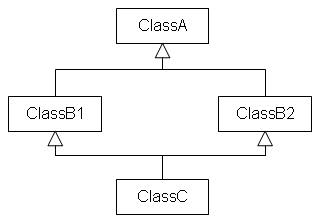

## C++ vtable/vtable ptr C++中的virtual

本文參考[C++中關於 virtual 的兩三事](https://medium.com/theskyisblue/c-%E4%B8%AD%E9%97%9C%E6%96%BC-virtual-%E7%9A%84%E5%85%A9%E4%B8%89%E4%BA%8B-1b4e2a2dc373),並且加上自己的經驗而紀錄。
<!-- more --> 
### static binding vs. dynamic binding

在 virtual 之前得先提到 binding。binding 一般指的是把一個東西對應到另一個東西上，在 C++ 中，binding 指的是函式呼叫與函式定義的連接，這個時機可能發生於 compile-time 或是 run-time，依據情況而定。
在 static binding 中，compiler 會在 compile-time 時就把函式定義與函式呼叫連結起來，因為比較早連接起來，所以又叫做 early binding。而在 dynamic binding 的情形中，這樣的連接會一直延遲至 run-time 才會發生，因此也可稱為 late binding。在 C++ 中，dynamic binding 主要可以透過 virtual 來達成。
在 static binding 中，由於呼叫函式的所有資訊都已經提前先知道了，所以在程式真正執行起來會比較快一些；反之，dynamic binding 的好處在於在 run-time 才決定，因此可以更彈性地呼叫函式。

### vtable/ vtable ptr

當我們宣告某個 class 的函式為 virtual 時，代表若有 derived class 的話，該函式可以被 redefined。virtual function 的 implementation 是透過 virtual table, or vtable 與 virtual table pointer, or vtable ptr。
只要一個 class 中有一個以上的 virtual 函式，那麼該instance(每一個由該 class 產生的 object)都會包含一個vtable與一個指向這個vtable的指標,vtable ptr。我們可以將 virtual table 想像成陣列，而陣列中的每個元素都是個指向 virtual 函式的 implementation 的指標。 

如底下的程式碼
```
class Base
{
public:
    virtual void func1();
    virtual void func1();
    void nonVirtualFunc();
};
class Derived : public Base
{
public:
    virtual void func2() override;
    void nonVirtualFunc();
};
Derived myDerived;
Base myBase;
```

當我們呼叫一個 instance 的 virtual 函式時，compiler 其實做了這三件事情
1. 由該 instance的 vtable vptr 找到其 vtable。
2. 找到 vtable 中，符合該函式的指標。
3. 執行前一步指標所指向的位置


在這邊我們有 class Base 含有兩個 virtual 函式 func1(), func2() 與 non-virtual 函式 nonVirtualFunc()，class Derived 繼承 Base，含有 override 的 virtual 函式 func2() 與 non-virtual 函式 nonVirtualFunc()。假設我們有兩個物件：一個 Base 的 object myBase 與另一個 Derived 的 object myDerived。那麼我們可以這樣子想像他們的關係：
myBase 物件中包含ptr，該指標指向其 vtable。在這邊因為有兩個 virtual 函式 func1(), func2()，所以 vtable 包含了兩個元素。而這兩個元素分別指向 Base::func1() 的 implementation 與 Base::func2() 的implementation。
myDerived 物件同樣地也包含了指向其 vtable ptr，vtable 也有兩個元素因為有兩個 virtual 函式 func1(), func2()，其中因為 Derived 沒有 override 函式 func1()，所以其指標指向的是 Base::func1() 的 implementation。另一方面，關於函式 func2() 的指標則指向 Derived::func2() 的 implementation

值得一提的是，vtable 中都不包含關於函式 nonVirtualFunc() 的元素，因為**該函式不是 virtual**。

### Public inheritance 裡 class 中的 virtual 函式

接著這邊來討論一下在 inheritance 中，一個 class 裡的函式什麼時候該加 virtual，什麼時候不該加 virtual

首先我們先定義**interface 函式宣告** 和 **函式定義**
#### interface 函式宣告
```
std::size_t numDigits(int number);
```

#### implementation 函式定義
```
std::size_t numDigits(int number)
{
    std::size_t digitsSoFar = 1;
    while((number/=10)!=0) ++digitsSoFar;
    return digitsSoFar;
}
```
當我們提到 inheritance 時，我們要先想清楚這個 function 想要繼承的是**函式宣告**還是**函式定義**; inheritance of interface 指的是我們只想要繼承函式的宣告，而 inheritance of implementation 則是繼承函式的定義。什麼時候該下 virtual 取決於我們想要繼承的是什麼：有時候只想要繼承函式宣告、有時候想要繼承函式宣告與定義，但允許 override 其定義、有時候想要繼承兩者但不允許 override 其定義。我們可以透過下面這個例子來說明:

```
class Shape {
{
public:
    virtual void draw() const = 0;
    virtual void error(const std::string& msg);
    int objectID() const;
    …
};
class Rectangle: public Shape{…};
class Ellipse: public Shape{…};
```
在這邊 Shape 是個abstract class(不能被具現化instantiated)，因為它包含至少一個純虛擬函式，此外，考慮到 public inheritance 的意義是 is-a(as opposite to private inheritance is has-a)；在任何從 Shape public inherited 的 derived class 中，所有函式的 interface 都必須被繼承。

#### Pure virtual 純虛擬函式
Pure virtual 的特性使得它們必須被 derived class **重新宣告**，且它們在 abstract class 沒有定義。宣告 pure virtual 函式的意義為，derived class 僅僅繼承函式的 interface。

Shape::draw 告訴所有 derived class「你必須提供 draw 函式，至於你要如何 implement 我並不清楚」。在這個例子中也相當正確，畢竟要分別畫出 Rectangle 與 Ellipse 的演算法應該差異非常大
> 宣告 pure virtual 函式的意義為，derived class 僅僅繼承函式的 interface

#### virtual 虛擬函式
virtual function or simple virtual function 則稍有不同。首先 derived class 仍然繼承函式的 interface，第二是 simple virtual 函式提供了一個 implementation，即**函式定義**。但是 derived class 可以 override。意即
> 宣告 simple virtual 函式的意義為，derived class 繼承函式的 interface 以及其 default implementation

Shape 透過這個意思告訴所有 derived class「你要提供 error 函式，但如果你不想要寫自己的版本的話，你可以用我的版本」。

#### non-virtual 函式

在 non-virtual 函式中，derived class 最好保留著函式原本的行為，不應該自己重新定義函式。同樣地，加上 derived class 繼承函式的 interface 後，我們可以這樣理解

> 宣告 non-virtual 函式的意義為，繼承函式的 interface 以及不更改函式原本的 implementation。

#### pure virtual/ virtual / non-virtual 小結
綜合上述三者，當一個 class 預計被當成 base class 時，通常都會有為數不少的 virtual 函式。但倘若真的存在某些函式`不應該被重新定義時，請不要幫他們任意加上 virtual`


### derived chain / inheritance chain

在繼承階層中，第一個建立的建構子是base class，這裡要說明一下，virtual是有穿透性(沒有人這樣形容，但其行為很像，有人再修正我一下, 參考自 [When should my destructor be virtual](https://isocpp.org/wiki/faq/virtual-functions#virtual-dtors))，Classes按一定的順序執行(Depth-first-left-to-right)，逐步更換vtable 中的implementation。 

> The very first constructors to be executed are the virtual base classes anywhere in the hierarchy. They are executed in the order they appear in a **depth-first left-to-right traversal** (從base class到derived classes) of the graph of base classes, where left to right refer to the order of appearance of base class names.

> After all virtual base class constructors are finished, the construction order is generally from base class to derived class. The details are easiest to understand if you imagine that the very first thing the compiler does in the derived class’s ctor is to make a hidden call to the ctors of its non-virtual base classes (hint: that’s the way many compilers actually do it). So if class D inherits multiply from B1 and B2, the constructor for B1 executes first, then the constructor for B2, then the constructor for D. This rule is applied recursively; for example, if B1 inherits from B1a and B1b, and B2 inherits from B2a and B2b, then the final order is B1a, B1b, B1, B2a, B2b, B2, D.

#### 小結

- virtual是有穿透性:再你的繼承物件中，如果您的基類具有虛擬方法，則您自己的方法是自動虛擬的。由於其他原因，您可能需要明確定義(explicit)方法，但不需要重新聲明virtual，確保它是虛擬的。不管你用虛擬聲明它，沒有虛擬聲明它，或者根本不聲明它，它仍然是虛擬的。
- Classes按一定的順序執行(Depth-first-left-to-right)，逐步更換vtable 中的implementation

### virtual inheritance.
多重繼承時，會有一種模擬兩可的情況，就是當兩個類別都繼承同一個基底類別，而這兩個類別又同時被另一個類別，以平行多重繼承的方式同時繼承


C類別將會擁有兩個A類別的複本，一個來自B1所繼承下來的，一個來自B2所繼承下來的，Compiler將會Confuse C類別的A是來自B1 或B2

**virtual inheritance**可解決這個問題。
```
class A {
    // implementation
};

class B1 : **virtual public A** {  
    // implementation
};

class B2 : **virtual public A** {  
    // implementation
};

class C : public B1, public B2 {
    // implementation
};
```
B1與B2以虛擬繼承的方式繼承了A類別，這個`好處是當有類別多重繼承了某個基底類別時，在該類別中將會只有一個基底類別存在`，而不會有多個複 本

### virtual destructor
為避免不可預期的錯誤，在security code中，要求base class的destrutor必須virtual。不多說，直接看例子，秒懂。 

> Deleting a derived class object using a pointer to a base class that has a non-virtual destructor results in undefined behavior. To correct this situation, the base class should be defined with a virtual destructor. For example, following program results in undefined behavior.

```
class base { 
  public: 
    base()      
    { cout<<"Constructing base \n"; } 
    ~base() 
    { cout<<"Destructing base \n"; }      
}; 
  
class derived: public base { 
  public: 
    derived()      
    { cout<<"Constructing derived \n"; } 
    ~derived() 
    { cout<<"Destructing derived \n"; } 
}; 
```
**output**
```
Constructing base
Constructing derived
Destructing base
```
derived的 destructor並未執行，因為這不是override而是hidden。正確的寫法應是：
```
class base { 
  public: 
    base()      
    { cout<<"Constructing base \n"; } 
    virtual ~base() 
    { cout<<"Destructing base \n"; }      
}; 
  
class derived: public base { 
  public: 
    derived()      
    { cout<<"Constructing derived \n"; } 
    ~derived() 
    { cout<<"Destructing derived \n"; } 
}; 
```
**output**
```
Constructing base
Constructing derived
Destructing derived
Destructing base
```

#### 結論
總結
virtual 的好處是避免冗余的程式碼，但需要多佔一些空間以及增加run-time，當然還有一些 virtual 的其他小細節
- polymorphic bases class destructor 
- 盡量要 virtual盡量避免讓 virtual 遇上 inline
- multiple inheritance 中 使用 virtual base class
- override virtual 函式加上 override確保你正在override一個interface而不是***create***一個函式。

這裡補完[C++中關於 virtual 的兩三事](https://medium.com/theskyisblue/c-%E4%B8%AD%E9%97%9C%E6%96%BC-virtual-%E7%9A%84%E5%85%A9%E4%B8%89%E4%BA%8B-1b4e2a2dc373)提點的資料。


